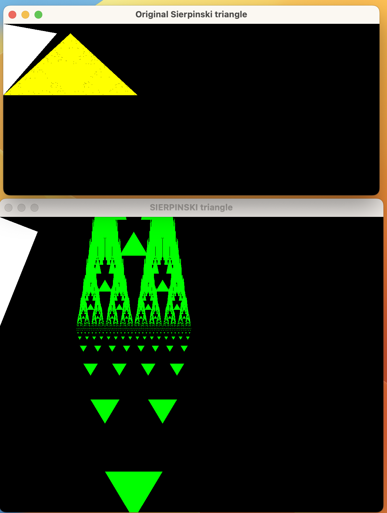

# Recursive Graphics
- Built the recursive graphics application with o2 integers for depth and width and display Sierpinski triangle on Windows.

## Features:

- Generate triangle to create random output which is called sierpinski triangle with 02 integers of depth and width.

- Sample `./triangle 5 15` and `./sierpinski 3 10`
- Recursive Graphics.

## To Set Up:
- Git clone repository.
- Set SFML environment:
[SFML](https://www.sfml-dev.org/)
- On Mac use `brew install sfml`
- Run `brew info sfml`   tofind where is sfml locate. My SFML is `"opt/homebrew/Cellar/sfml/2.5.1_2"`. Use flag` -I` and `-L` for  `include`and `lib`.

- Run:
  - `g++ sierpinskiMain.cpp sierpinski.cpp -I/opt/homebrew/Cellar/sfml/2.5.1_2/include -L/opt/homebrew/Cellar/sfml/2.5.1_2/lib -o  sierpinski -lsfml-graphics -lsfml-window -lsfml-system `
  - `g++ triangleMain.cpp triangle.cpp -I/opt/homebrew/Cellar/sfml/2.5.1_2/include -L/opt/homebrew/Cellar/sfml/2.5.1_2/lib -o  triangle -lsfml-graphics -lsfml-window -lsfml-system `
  - `./triangle 5 15` and `./sierpinski 3 10`

  ## Author
  - William Vo
  ## Technologies used:
  - `C++`
  - SFML: `Graphics`, Window, and System

